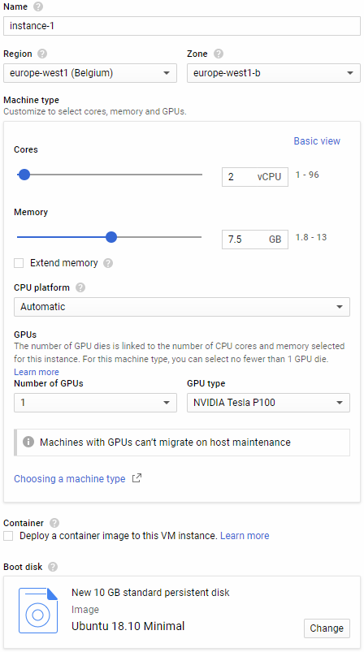
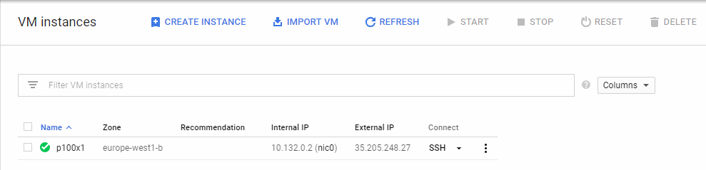

# CS4400 / CS7NS1: Infernoballs

Group Members:
1. [Ciarán Ingle](https://github.com/inglec)
2. [Deprub Chakraborty](https://github.com/rupdeb)
3. [Sridhar Amirneni](https://github.com/sridharamirneni)
4. [Suprith Ramesh](https://github.com/suprithramesh)

[Link](https://github.com/sftcd/cs7ns1/tree/master/assignments/practical5) to the assignment's GitHub repo.

## Hashes

### Methods

Wordlists & masks:
1. Five lowercase letters (Generated using `pwgen -0 -A 5`)
2. Two four-letter words concatenated (Generated from English dictionaries in Ubuntu's `/usr/share/dicts/words/`)
3. [rockyou.txt](http://downloads.skullsecurity.org/passwords/rockyou.txt.bz2)

### Formats

I've formatted the hashes as follows: `share:hash`.

| Type               | Command                                                                    |
|:------------------ |:-------------------------------------------------------------------------- |
| PBKDF2-HMAC-SHA256 | `john --format=PBKDF2-HMAC-SHA256-opencl --wordlist=<wordlist> <filename>` |
| sha1crypt          | `john --format=sha1crypt-opencl --wordlist=<wordlist> <filename>`          |
| sha512crypt        | `john --format=sha512crypt-opencl --wordlist=<wordlist> <filename>`        |
|                    | `hashcat -a 0 -w 4 -O -m 1800 --username <wordlist> <filename>`            |
| argon2i            | `john --format=argon2 --wordlist=<wordlist> <filename>`                    |

### Hashrates

#### John The Ripper

| Type               | Device | Hashrate  |
|:------------------ |:------:| ---------:|
| PBKDF2-HMAC-SHA256 | P100   | 40,000c/S |
|                    | 1080Ti | TODO      |
|                    | c5.9x  | 17,700c/S |
| sha1crypt          | P100   | 7,060c/S  |
|                    | 1080Ti | TODO      |
|                    | c5.9x  | 2,500c/S  |
| sha512crypt        | P100   | 700c/S    |
|                    | 1080Ti | TODO      |
|                    | c5.9x  | 600c/S    |
| argon2i            | c5.9x  | 100c/S    |

#### Hashcat

| Type        | Device | Hashrate |
|:----------- |:------:| --------:|
| sha512crypt | P100   | 1170H/s  |
|             | 1080Ti | 150H/s   |

### Software

JohnTheRipper seems to work better than Hashcat for PBKDF2 hashes.

Otherwise, Hashcat appears to be better.

### Progress

#### Level 1

Level 1 seems to only require `rockyou.txt`.

| Type               | Amount  |
|:------------------ |:-------:|
| PBKDF2-HMAC-SHA256 | 65/65   |
| sha1crypt          | 0/50    |
| sha512crypt        | 0/58    |
| argon2i            | 0/56    |

PBKDF2-HMAC-SHA256:

1. `rockyou.txt`: 65 cracked. (Ciarán)

sha1crypt:

1. `five.txt`: 0 cracked. (Ciarán)
2. `fourfour.txt`: 0 cracked. (Ciarán)
3. `rockyou_9char.txt`: 0 cracked. (Ciarán)
4. `rockyou_7char.txt`: In progress... (Ciarán)

argon2i:
1. `rockyou_5char.txt`: In progress... (Ciarán)

## Instances

### AWS / RosettaHub

The `c5.9xlarge` instance seems to be the best CPU instance you can rent. It is a 32-thread CPU with AVX-512.

This is the best instance for cracking Argon2.

### Google Cloud Platform

Google Cloud Platform's [Compute Engine](https://console.cloud.google.com/compute/) offers $300 free credit.

A custom instance with two threads and a single P100 GPU seems to be the best overall instance for cracking everything apart from Argon2. Certain regions such as `europe-west2` will **not** allow you to access a GPU instance.

I would recommend `europe-west1`.

You are limited to a single GPU across all instances unless you request a limit increase.

#### Setup

Create a new [VM instance](https://console.cloud.google.com/compute/instances) with the following specs:



SSH into the instance.



Update all packages first and install build dependencies:

```
sudo apt update
sudo apt upgrade
sudo apt install build-essential linux-image-extra-virtual
```

Install NVIDIA TESLA P100 drivers:

```
wget http://uk.download.nvidia.com/tesla/410.72/NVIDIA-Linux-x86_64-410.72.run
sudo /bin/bash NVIDIA-Linux-x86_64-410.72.run
```

Install [JohnTheRipper](https://www.openwall.com/john/):

```
sudo apt install libssl-dev zlib1g-dev yasm libgmp-dev libpcap-dev pkg-config libbz2-dev nvidia-opencl-dev

git clone git://github.com/magnumripper/JohnTheRipper -b bleeding-jumbo jtr

cd jtr/src/
./configure && make -s clean && make -sj4
```

Install [Hashcat](https://hashcat.net/hashcat/):

```
sudo apt install hashcat
```

Clone the Git repo:

```
git clone https://github.com/inglec/infernoballs
```

And you're done!

## Meetings

| Date  | Time  | Location           | Description           |
|:-----:|:-----:|:------------------ |:--------------------- |
| 23/10 | 12:00 | South Leinster St. | Initial meeting       |
| 30/10 | 18:00 | South Leinster St. | Infernoballs released |
